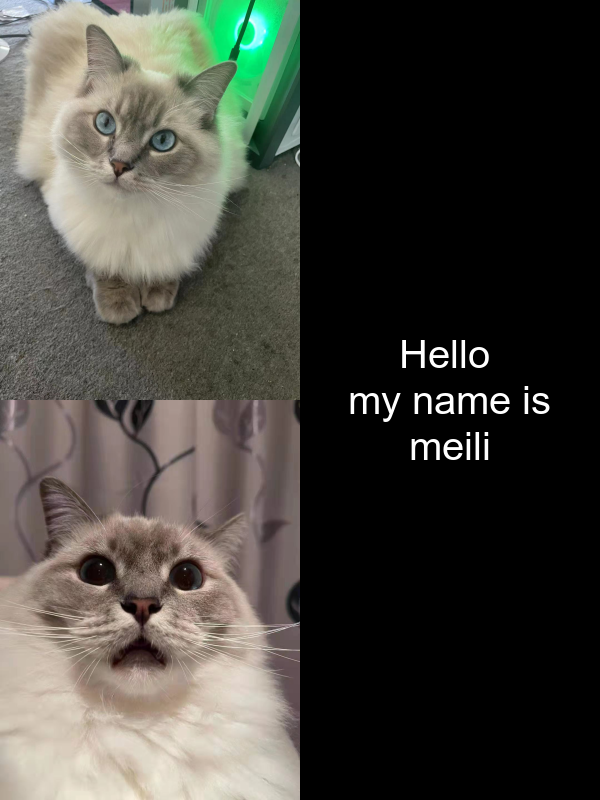

# Kia ora te ao!

Welcome to my test website! 

## About me

**I'm a computer science student.**

## I also love memes!

Below is a meme I made using the R package [{magick}](https://cran.r-project.org/web/packages/magick/vignettes/intro.html).

*A really short and unhelpful summary of my inspiration for the meme is:*

1. It's my friend's cat which is called '美丽'. It means beauty.
2. I took a picture for it and used it.

###Code###

library(magick)

meme_square <- image_blank(width=300,height=800,color = "#000000") %>%
  image_annotate(text="Hello \n my name is \nmeili",color = "#FFFFFF",size = 40,gravity = "center")
meme1 <- image_read("https://raw.githubusercontent.com/ChloeHades/stats220/main/meme1.png") %>%
  image_scale(300) 
meme2 <- image_read("https://raw.githubusercontent.com/ChloeHades/stats220/main/meme2.png") %>%
  image_scale(300)
meme_list <-  c(meme1, meme2)
meme <- image_append(meme_list,stack = TRUE)
meme_list2 <- c(meme, meme_square)
meme_final <- image_append(meme_list2)
image_write(meme_final, "my_meme.png")

 

meme3 <- image_read("https://raw.githubusercontent.com/ChloeHades/stats220/main/meme3.png") %>% image_scale(300)
meme4 <- image_read("https://raw.githubusercontent.com/ChloeHades/stats220/main/meme4.png") %>% image_scale(300)
meme5 <- image_read("https://raw.githubusercontent.com/ChloeHades/stats220/main/meme5.png") %>% image_scale(300)
meme6 <- image_read("https://raw.githubusercontent.com/ChloeHades/stats220/main/meme6.png") %>% image_scale(300)
meme_list1 <- c(meme1, meme2, meme3, meme4,meme5, meme6)
memes <- image_animate(meme_list1, fps = 1)
image_write(memes, "my_meme.gif")
